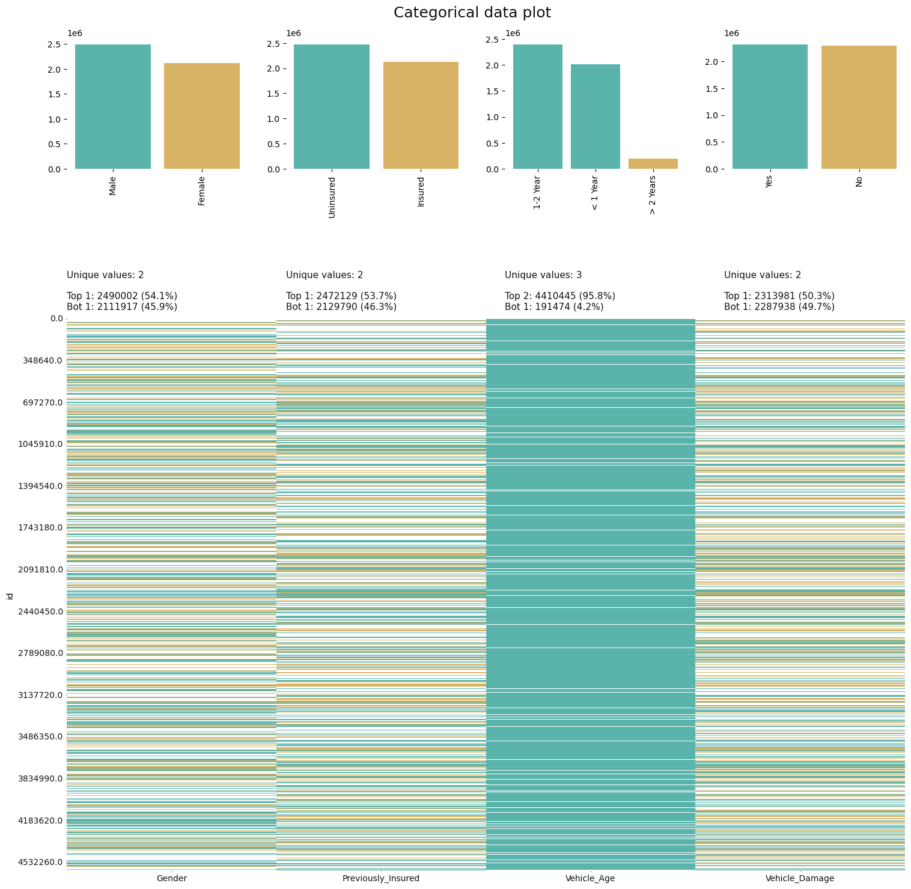

# 👋 Hi, I'm Paulo Araya-Santiago! Welcome to my portfolio.

## 🌟 Introduction
I am a passionate Data Scientist in the making, currently studying to master Machine Learning techniques. My background in communications and audiovisual production, combined with my technical skills, allows me to bring a unique perspective to data analysis and visualization.

## 🎓 About Me
- 🎓 I'm currently studying to work as a Data Scientist using Machine Learning. I have a Data Science specialized in Machine Learning professional certificate from Codecademy.
- 🎥 I'm a majoring in communications and audiovisual production at the University of Costa Rica.
- 📸 Freelance Photographer.
- 🌐 Fluent in English and Spanish with some basic German and Portuguese knowledge.

## 💻 My Projects
Here are some of the projects I've been working on:

### [Binary Classification of Insurance Cross Selling Kaggle Playground Series S4E7](Binary-Classification-of-Insurance-Cross-Selling/portafolio_version.ipynb)

This project was my favorite so far because it really made me delve into and develop my skills as a Data Scientist. I discovered some interesting libraries like KLIB and Optuna, which I will probably be using in many of my future projects. The dataset was massive and sometimes transformations would make the training set larger than 2GB. This created some difficult contraints on my system and on cloud services when trying to model. I created at least fifty, if not more, notebooks for this competition. I got to explore the workflow of many other talented data scientist and I'm excited to implement some of the code I learned along the way. Here is a link to my official submission to the competition: [Kaggle Submission Version.](https://www.kaggle.com/code/pauloarayasantiago/ps-s4e07-blend-cbc-lgbm-xgb-0-889)

### [Predicting Cancer Using GradientBoost](https://github.com/pauloarayasantiago/portafolio/blob/main/Predicting%20Cancer%20using%20GradientBoost/predicting_cancer_using_gradientboost(portafolio_edition).ipynb)

This project aims to predict cancer using the GradientBoost algorithm. The dataset includes features like age, BMI, physical activity, alcohol intake, gender, smoking habits, family history of cancer, and diagnosis. Key steps involve data preprocessing, exploratory data analysis, and training the GradientBoost model. The focus is on optimizing the model to minimize false negatives, ensuring a balance between sensitivity and specificity. The project concludes with model evaluation and visualization of results.

### [Classification with Academic Success Using LGBM Kaggle Playground Series S4E6](https://github.com/pauloarayasantiago/portafolio/blob/main/Classification%20with%20academic%20success%20using%20LGBM/classification_with_academic_success_using_lgbm(portafolio_edition).ipynb)

This project uses LightGBM (Light Gradient Boosting Machine) to classify academic success based on various features such as age, marriage status, and international status. The notebook includes steps for data visualization, feature engineering, and handling imbalanced classes using SMOTE (Synthetic Minority Over-sampling Technique). The trained LightGBM model is evaluated on a validation set, and predictions are made on test data. This project was done for a Kaggle competition.

### [ML Emotions vs Social Media Usage (AutoML + Clustering)](https://github.com/pauloarayasantiago/portafolio/blob/main/ML%20emotions%20vs%20social%20media%20usage%20(automl%2Bcluster)/ml_emotions_vs_social_media_usage_automl_cluster(portafolio_eidtion).ipynb)
/clustering_results.png)
This project explores the relationship between emotions and social media usage using AutoML (Automated Machine Learning) and clustering techniques. The analysis involves data preprocessing, exploratory data analysis, and applying clustering algorithms to identify patterns and groups within the data. The project highlights key findings from the clustering results and discusses their implications on understanding social media usage patterns.

## 📫 How to Reach Me
- Email: [pauloaraya54@gmail.com](mailto:pauloaraya54@gmail.com)
- LinkedIn: [Paulo Araya-Santiago](https://www.linkedin.com/in/paulo-araya-santiago-b5a202270/)
- Kaggle: [Paulo Araya-Santiago](https://www.kaggle.com/pauloarayasantiago)

## 🌟 Skills
- **Languages**: Python (Pandas, NumPy, SciPy, Matplotlib, Seaborn, Klib), SQL (SSMS, PostgreSQL, BigQuery)
- **ML Frameworks**: Scikit-Learn, Pytorch, CatBoost, LightGBM, XGBoost, FLAML
- **Tools**: Power BI, Excel, Git, Azure Cloud Services, Google Cloud Platform
- **Data Processing**: Feature Engineering, Model Optimization, Statistical Analysis

### Data Science & ML
- Statistical Analysis & Modeling
- Feature Engineering
- Model Optimization
- AutoML Frameworks

### Data Engineering
- ETL Pipeline Development
- Database Management
- Cloud Services Integration
- API Development

### Visualization
- Power BI Dashboard Creation
- Data Storytelling
- Interactive Visualizations
- DAX Measures

## 🏆 Achievements
- Completed [Codecademy Data Science specialized in Machine Learning].
- Contributed to [Kaggle Playground Series - Season 4, Episode 6]([https://www.kaggle.com/pauloarayasantiago](https://www.kaggle.com/code/pauloarayasantiago/classification-with-academic-success-using-lgbm)).
- Contributed multiple notebooks to [Kaggle Playground Series - Season 4, Episode 7](https://www.kaggle.com/code/pauloarayasantiago/ps-s4e07-blend-cbc-lgbm-xgb-0-889)

## 🔭 Currently Learning
- Advanced Machine Learning techniques, including deeplearning for LLMs and Reinforcement learning.
- Data Engineering.

## 🎯 Goals
- To contribute to impactful data science projects.
- To become proficient in deep learning and neural networks.
- To solve real world issues at large scales using AI, including, but not limited to, topics related to Electric Vehicles, Renewable Energy, and Resource Pipelines.

Thanks for stopping by!

